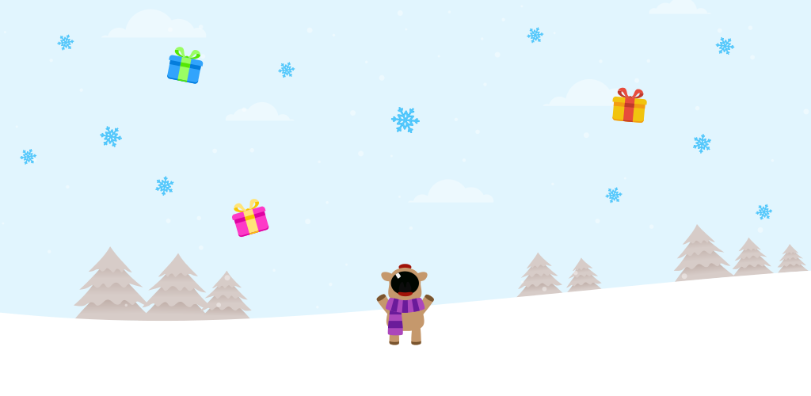

# Bored Rudolf



Tired of seeing spinners while loading content? Try eating snowflakes instead!


## What?

This is an Android library for showing a game hidden inside an pull-to-refresh layout.


## How do I use it?

The library is available on jCenter. Add this to your app's `dependencies` section:

```groovy
compile 'org.faudroids.boredrudolf:boredrudolf:0.2.0'
```

In the layout where you would like to use pull-to-refresh, add the following as the root xml element:

```xml
<org.faudroids.boredrudolf.ui.CustomSwipeRefreshLayout
    android:id="@+id/layout_swipe"
    android:layout_width="match_parent"
    android:layout_height="match_parent"
    >
        
  <!-- content goes here, only one child! -->
        
</org.faudroids.boredrudolf.ui.CustomSwipeRefreshLayout>
```

and in your activity / fragment you can use the following to receive a callback whenever the user has requested a refresh

```java
CustomSwipeRefreshLayout refreshLayout = (CustomSwipeRefreshLayout) findViewById(R.id.layout_swipe);
refreshLayout.setOnRefreshListener(new CustomSwipeRefreshLayout.OnRefreshListener() {
	@Override
	public void onRefresh() {
		// update content etc.
	}
});```

To stop refreshing use

```java
refreshLayout.refreshComplete();
```

See the [demo code](demo) for a working example.


## Demo

Available on the [Google Playstore](https://play.google.com/store/apps/details?id=org.faudroids.loooooading) or watch the following short movie:

[](https://youtu.be/cYS0aT-EowM)


## License

Copyright 2015 FauDroids

Licensed under the Apache License, Version 2.0 (the "License"); you may not use this file except in compliance with the License. You may obtain a copy of the License at

http://www.apache.org/licenses/LICENSE-2.0

Unless required by applicable law or agreed to in writing, software distributed under the License is distributed on an "AS IS" BASIS, WITHOUT WARRANTIES OR CONDITIONS OF ANY KIND, either express or implied. See the License for the specific language governing permissions and limitations under the License.
